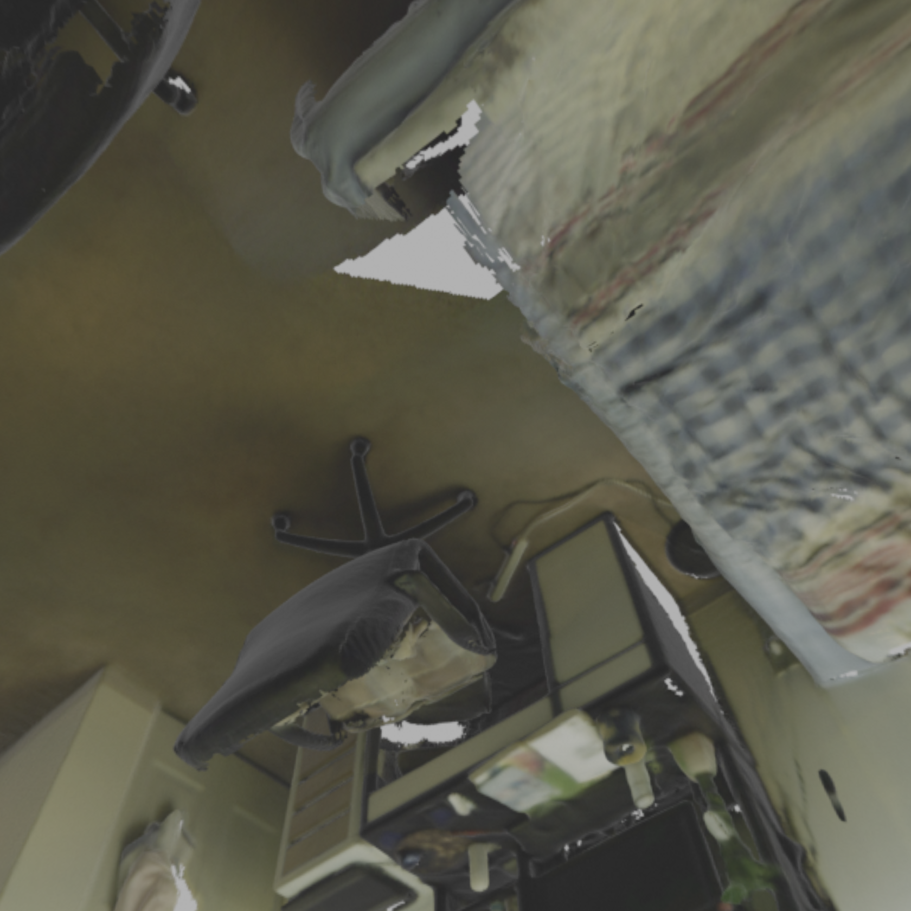
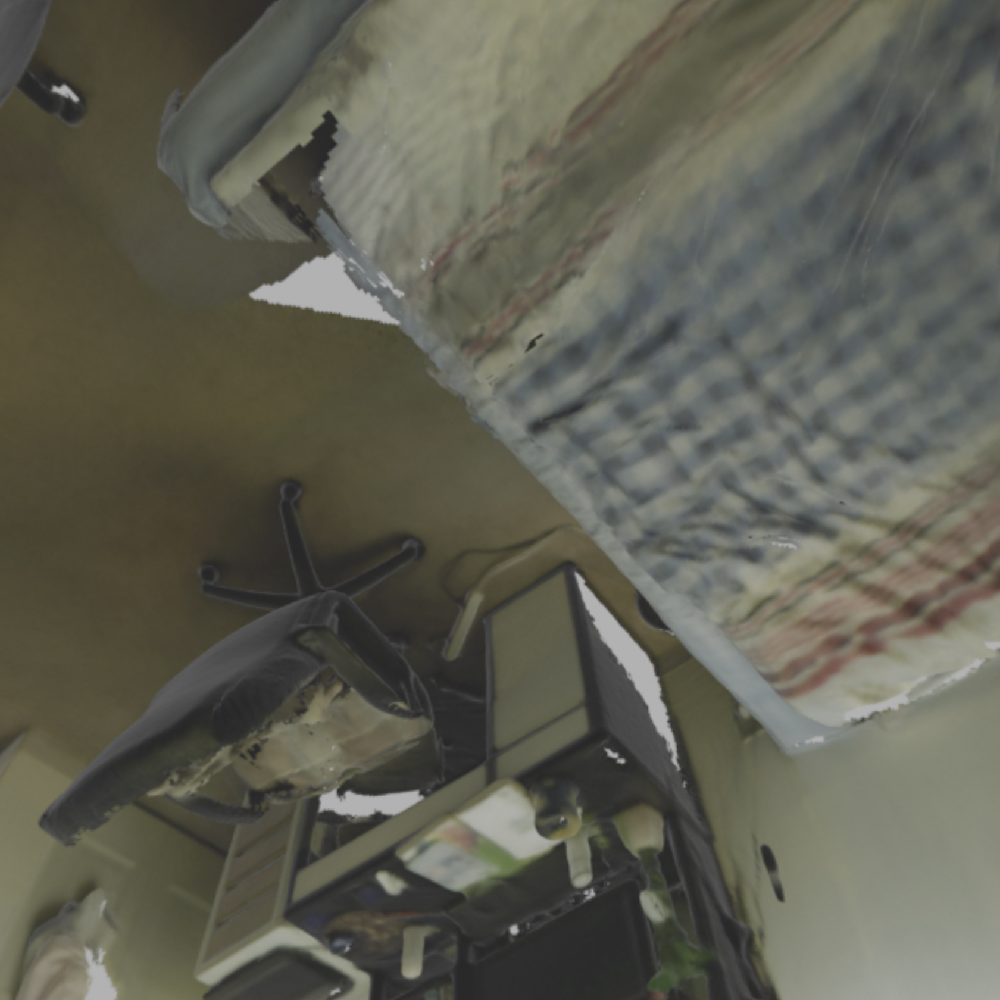
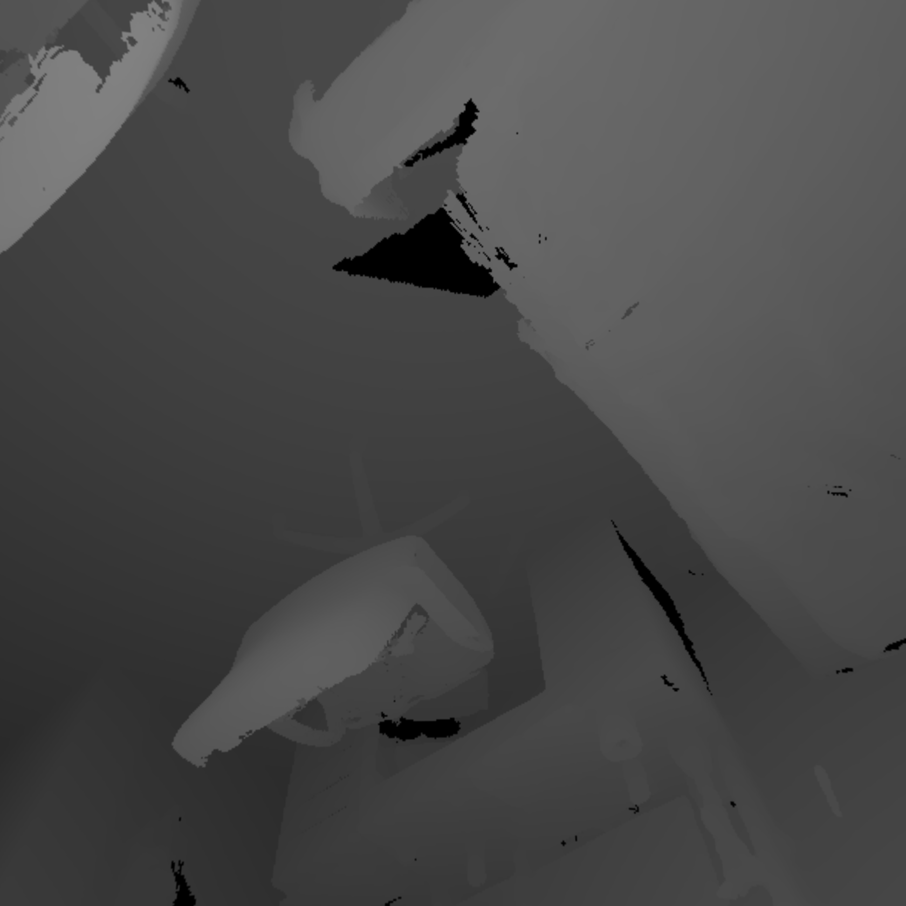

# Scene-Omni-Stereo

Scene-Omni-Stereo is an omni-directional dataset which was generated from the models of the SceneNN dataset and rendered by the Department, "Digital Signal Processing and Circuit Design" at Technische Universitat Chemnitz. The image pairs were generated with a virtual stereo camera placed at the ceiling at 1000 different locations with different elevation angles. The flats were split into three parts: training (34000 images), validation (5000 images) and testing (10000 images). The Rendering was done in Blender 2.8 with Cycles rendering engine. The reference camera C_0 was always at a constant height of 2.3 m which is and the second camera C_1 was placed right of it, with a baseline of 30 cm.

  
  
  

<figcaption> &emsp;&emsp;&emsp;&emsp;&emsp;&emsp;&emsp;&emsp;&emsp;&emsp; Distorted Left Image
</figcaption>
<figcaption> &emsp;&emsp;&emsp;&emsp;&emsp;&emsp;&emsp; Distorted Right Image
</figcaption>
<figcaption> &emsp;&emsp;&emsp;&emsp;&emsp; Distorted Disparity Image
</figcaption>

## Undistortion
The original dataset was undistorted using rectifciation maps and remaped into a perspective dataset.
The python file "Undistortion.py" undistorts the dataset, which takes input as the location of where the original dataset exists and the output as the location of where the post-processing dataset should be stored 

  
  
  

<figcaption> &emsp;&emsp;&emsp;&emsp;&emsp;&emsp;&emsp;&emsp;&emsp;&emsp; Undistorted Left Image
</figcaption>
<figcaption> &emsp;&emsp;&emsp;&emsp;&emsp;&emsp; Undistorted Right Image
</figcaption>
<figcaption> &emsp;&emsp;&emsp;&emsp; Undistorted Disparity Image
</figcaption>
