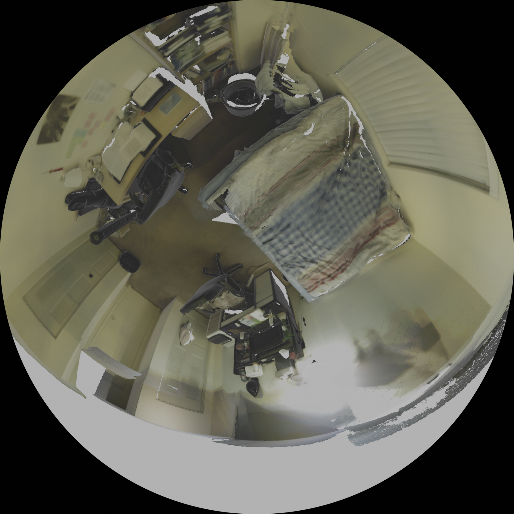
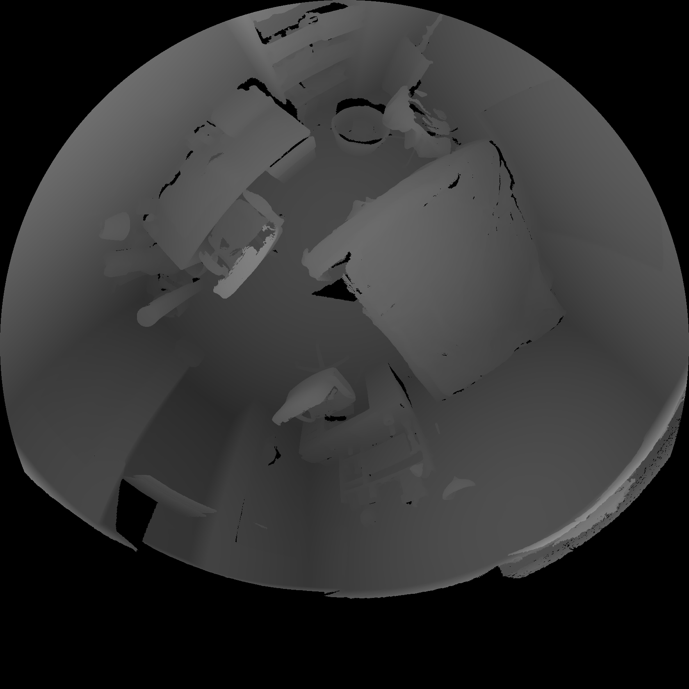

# Scene-Omni-Stereo

Scene-Omni-Stereo is an omni-directional dataset generated by the Department, "Digital Signal Processing and Circuit Design" at Technische Universitat Chemnitz.

  <figcaption> Your text </figcaption>
  
  

# Undistortion
The original dataset was undistorted using rectifciation maps and remaped into a perspective dataset.
The python file "Undistortion.py" undistorts the dataset, which takes input as the location of where the original dataset exists and the output as the location of where the post-processing dataset should be stored 
